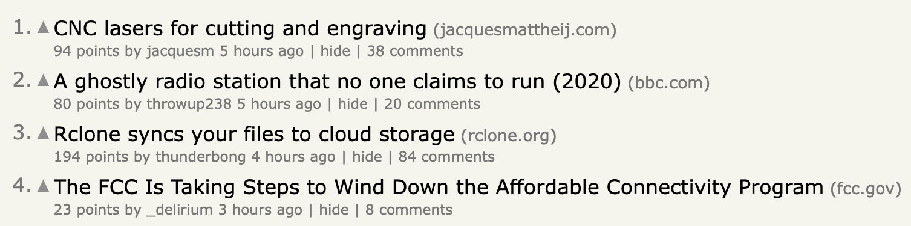
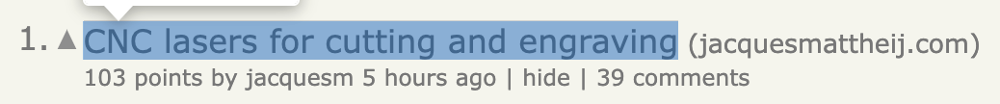
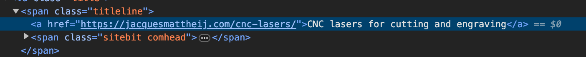
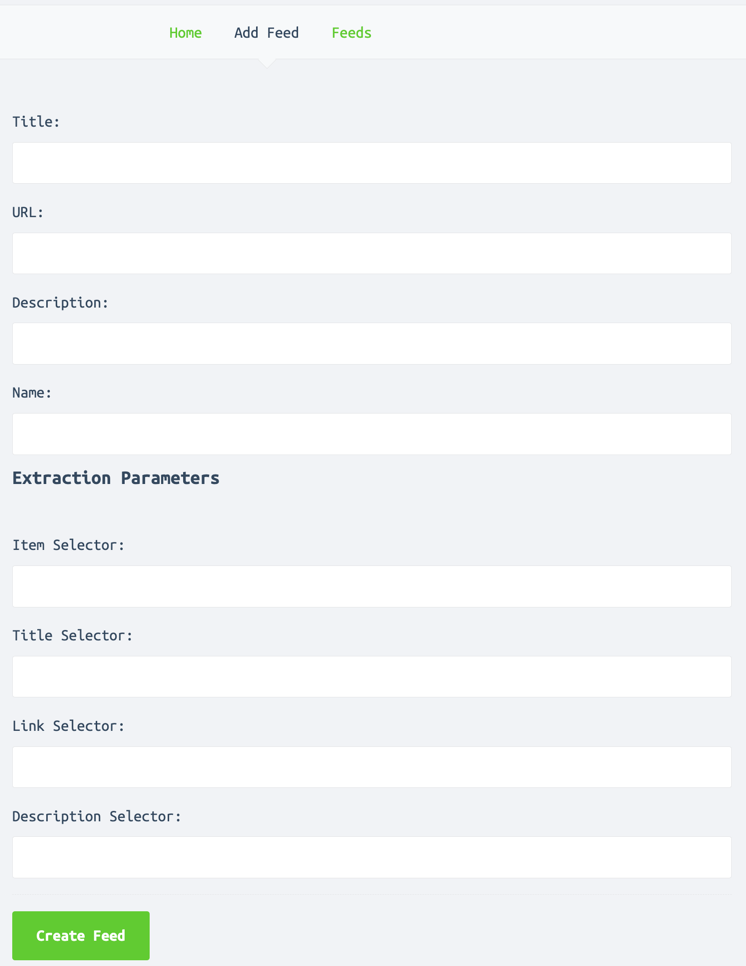
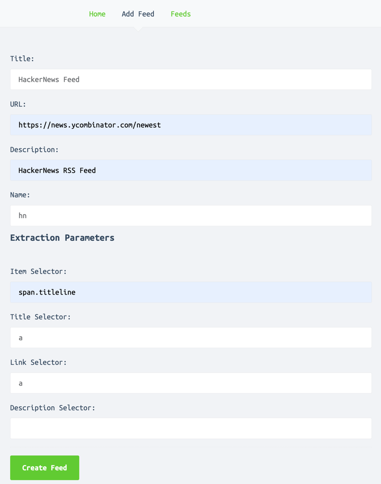
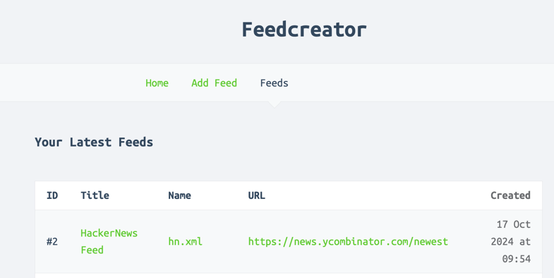

### feedcreator

- This project aims to turn any website to RSS Feed which we can then subscribe to using RSS readers.
- This [link](https://www.xul.fr/en-xml-rss.html) explains what are RSS feeds pretty well.
-

### A little Theory

- The following is structure of a simple RSS feed.

```xml

<rss version="2.0">
    <channel>
        <title>CareerVault</title>
        <link>https://www.careervault.io/remote?category=software</link>
        <description>Careervault Jobs Feed</description>
        <item>
            <title>Senior Software Engineer</title>
            <link>
                https://careervault.io/remote/beamery-10955/software/senior-software-engineer-remote-london-uk-5157167
            </link>
            <description></description>
            <pubDate>Thu, 17 Oct 2024 10:27:41 GMT</pubDate>
            <guid>
                https://careervault.io/remote/beamery-10955/software/senior-software-engineer-remote-london-uk-5157167
            </guid>
        </item>
    </channel>
</rss>
```

- Going through above we will know that to create RSS Feed we mainly need two elements: `title` and `link`.
  `description` is optional
- Now, a webpage consists of elements like `<li>`, `<a>`, `<article>`, `<div class="panel">`. `class` attributes are
  used to apply `css` to a bunch of elements together. They also helps in uniquely identifying elements on the webpage
  along with `id`s
- So, for creating RSS feed of any website we need to identify items with their css selector i.e `class` attribute on a
  webpage which can give us the `title` and `link`.
- On the form you will find following 4 fields :
    - `itemSelector` : for selecting the item from which we can get `title` and `link`.
    - `titleSelector`: for selecting the title from the item
    - `linkSelector` : for selecting the link
    - `descSelector` : for selecting the description element

### Example of selecting items for creating RSS feed



- This has 4 items in list format. In a day these items keep getting updated and we can use RSS feeds to track them.
- A single item is something like :



- To identify the `tag` and `class` associated with the list item we can right-click on the list title and select
  `inspect`
- The result is shown below:



- itemSelector would be `span` with `class` attribute `titleline` which will be written as `span.titleline`
- titleSelector will be `a`
- linkSelector will be also `a`
- Now we can fill the below form



- *Title* is the title of the feed with which you would like to track the feed. Here it could be like -
  `HackerNews Feed`
- *URL* is the link of the feed. Here `https://news.ycombinator.com/newest`
- *Description* is optional but could be something to describe the feed.
- *Name* is something to uniquely identify the feed one is tracking. It could be a short name like `hn`
- Now we need to fill the extractor parameters we identified earlier. From the above example:
    - For item selector we have to use `span.titleline`
    - For title selector we have to use just `a`.
    - For link selector we have to use just `a`.
- After filling the form, it should look like this:



- Once we submit it we will get a page which will have the feed url with other details and will look like this:


- Copy the `hn.xml` link - `http://localhost:8080/static/rss/hn.xml` and add it to any of the RSS Feed readers for tracking

### QuickStart

- `make init` to setup the database and download the dependencies.
- `make run` to start the application locally.
- `make build` to build the application locally.
- `make clean` to purge the contents of the database
- Don't forget to add the path to your browser executable for `path` flag. The default now is **Brave Browser** in Mac

### Design & Implementation

- This project is using [colly](https://github.com/gocolly/colly) library for scraping the webpage.
- The feeds are saved under `ui/static/rss` directory and there is a `feeds.db` table where we save feed metadata.
- Two functions are scheduled at a configurable interval in `main.go`. Using the metadata it rescans all **urls** to
  update or clean the feed items.
- For cleaning, the scheduler runs every 90 minutes and it deletes feeds which are more than `3 days` old which can be changed.
- For updating, the scheduler runs every 60 minutes.
- For loading dynamic websites it uses [chromedp](https://github.com/chromedp/chromedp)

### Hosting

- There is a github workflow which creates a docker image for self-hosting.

### Remarks

- Few feeds along with their metadata is included.
- Currently, we rescan all the feeds at a fixed interval. We can optimize it to scan each site at a fixed interval.
- We are also not passing request headers like `If-Modified-Since` or checking response headers like `Last-Modified`.